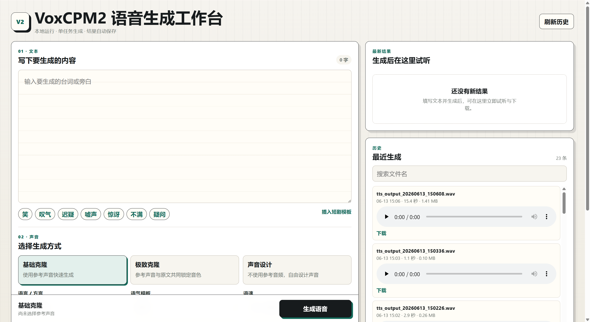

# VoxCPM2 语音生成工作台

基于 [OpenBMB/VoxCPM2](https://github.com/OpenBMB/VoxCPM) 和 Flask 构建的本地语音生成网页应用，支持声音设计、基础声音克隆、极致声音克隆、长文本分段和生成历史试听。

模型权重、参考音频和生成结果不会提交到 GitHub。首次使用时需要单独下载模型。



## 功能

- 声音设计：使用文字描述生成声音
- 基础克隆：使用参考音频克隆音色
- 极致克隆：使用参考音频和对应文字稿提高相似度
- 多语言和中文方言提示
- 语气模板、语速调整和长文本自动分段
- 网页端上传参考音频、查看进度、试听和下载结果

## 环境要求

- Python 3.10 至 3.12
- NVIDIA GPU，建议显存至少 8 GB
- CUDA 兼容版本的 PyTorch
- FFmpeg
- 模型和依赖需要至少约 10 GB 磁盘空间

## 安装

```bash
git clone https://github.com/Tompomelo15612/voxcpm2-web-workbench.git
cd voxcpm2-web-workbench

conda create -n voice python=3.12 -y
conda activate voice

pip install torch==2.7.0 torchvision==0.22.0 torchaudio==2.7.0 --index-url https://download.pytorch.org/whl/cu128
pip install -r requirements.txt
```

以上版本组合已在 AutoDL CUDA 12.8 环境验证。不要单独升级 `torch` 或
`torchaudio`，二者二进制版本不匹配会导致导入失败。其他显卡环境请参考
[PyTorch 安装页面](https://pytorch.org/get-started/locally/)选择匹配组合。

## 下载模型

运行项目自带的 ModelScope 下载脚本：

```bash
python download_model.py
```

模型会下载到：

```text
models/VoxCPM2/
```

模型文件不会提交到 GitHub。

下载完成后，可以运行无需参考音频的最小生成测试：

```bash
python test.py
```

测试音频会保存到 `outputs/`。

## 启动网页应用

Windows 或 Linux：

```bash
python app.py
```

浏览器访问：

```text
http://127.0.0.1:6006
```

更多安装细节请查看 [SETUP.md](SETUP.md)，网页功能说明请查看 [WEB_APP.md](WEB_APP.md)。

## 项目结构

```text
voxcpm2-web-workbench/
├── app.py
├── tts_engine.py
├── download_model.py
├── requirements.txt
├── templates/
├── static/
├── models/          # 本地下载，不提交
├── references/      # 用户上传，不提交
└── outputs/         # 生成结果，不提交
```

## 使用声明

VoxCPM2 模型采用 Apache-2.0 许可证。使用声音克隆功能时，请确保已取得声音所有者明确授权，不得用于冒充、诈骗、侵权或其他违法用途。

## 许可证

本项目代码采用 [Apache License 2.0](LICENSE) 开源许可证。
